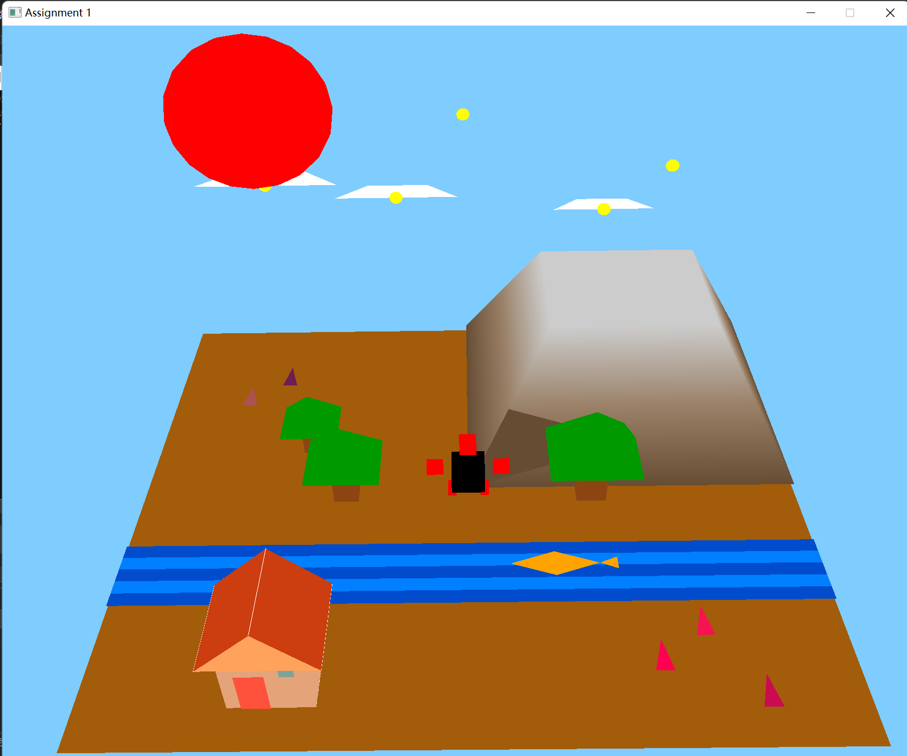

**Read this in other languages: [中文](README_zh.md), [English](README.md).**

# OpenGL 3D Scene Project 
 
   
 
## Project Overview 
This is an interactive 3D scene built with OpenGL, featuring rich terrain elements (ground, river, mountains), dynamic objects (swimming fish, rotating sun, sparkling stars), a controllable character, and various structures and vegetation. Users can freely explore the scene using keyboard and mouse controls.
 
## Core Features 
### 🎮 Interactive Controls 
- **Character Movement**: Arrow keys for navigation, Spacebar for jumping animation.
- **Camera Control**: WSAD for movement, mouse for orientation, scroll for zoom.
- **Color Cycling**: Press P to cycle through 7 preset body colors.
 
### 🌟 Dynamic Behaviors 
| Object      | Animation                | Technique               |
|-------------|--------------------------|-------------------------|
| Fish        | X-axis oscillation       | Sine-based displacement |
| Sun         | Circular orbit rotation  | Polar coordinate math   |
| Grass       | Color wave effect        | Fragment shader blending|
| Stars       | Y-axis rotation (30°/s)  | Model matrix rotation   |
 
## Object Specifications 
### 🏔️ Terrain System 
- **Ground**: Brownish plane (RGB: 0.8, 0.6, 0.2).
- **River**: Segmented blue/white stripes simulating water flow.
- **Mountain**: Tri-layer color gradient for a three-dimensional effect.
 
### 🏠 Structures & Vegetation 
```cpp 
// House construction example 
drawHouse() {
  createBase(gray cube);
  addWalls(beige cuboid);
  buildRoof(brown pyramid);
  drawWindows(pink/blue squares);
}
```

## Tech Stack
OpenGL 4.3: Core rendering pipeline.\
GLM: Matrix/vector operations.\
GLFW 3.3: Window/input management.\
GLEW 2.1: Extension handling.

## Installation Guide
### Requirements
OpenGL 4.3 compatible GPU.\
C++ compiler (GCC/MSVC/Clang).\
Third-party libraries: GLEW + GLFW + GLM.
