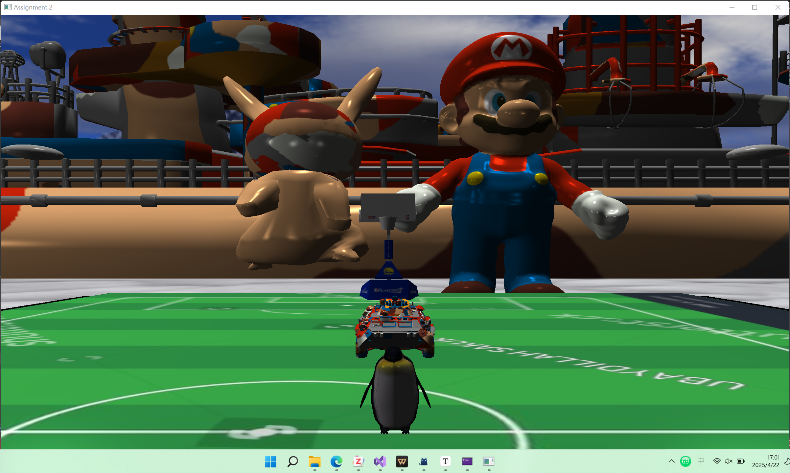
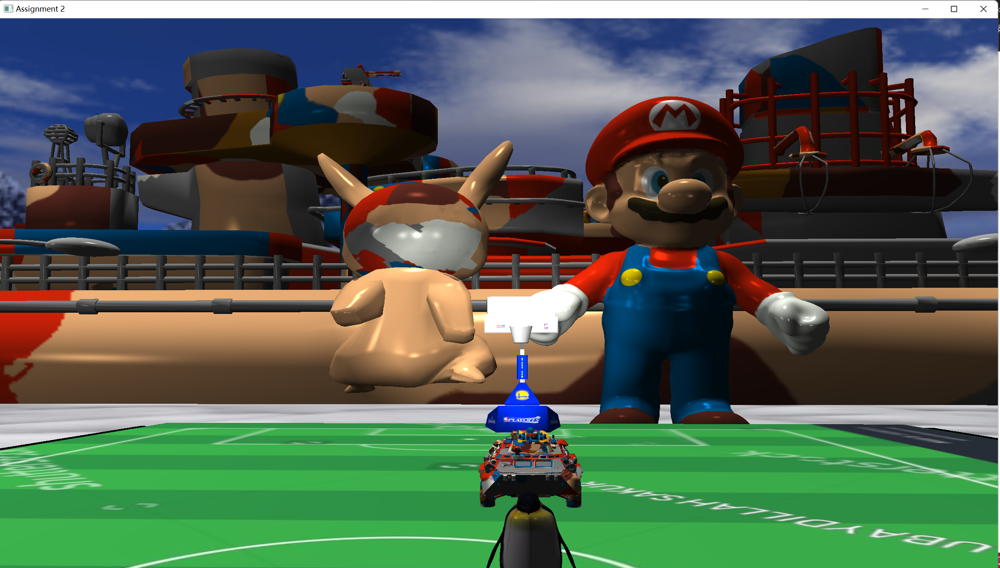
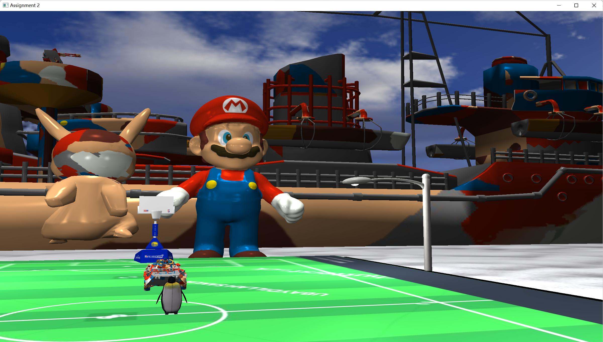

# Assignment 2: **纹理和照明**

​	本项目是一个使用 C++ 和 OpenGL (利用 GLEW, GLFW, 和 GLM 库) 开发的交互式 3D 场景渲染器，创建一个包含复杂模型、纹理映射、多种光源和用户交互的 3D 环境。场景的核心是一个带有可控企鹅模型的冰雪球场环境，并加入了天空盒、可切换的昼夜效果以及多个额外的装饰性模型，整体想要打造的场景就是**企鹅带领海陆军队一起踢足球或者打篮球，从气势上打败对方(doge)**。

​	在我的环境中缺少`zlib.dll`,因此在可执行文件整合部分我加入了该库文件

​	最终的实现效果如下：

* **复杂模型加载:** 使用 `Model` 类加载了多个 `.obj` 模型文件，包括核心的企鹅 (`penguin.obj`)、雪地 (`snow.obj`)，以及**球场、路灯、太阳/月亮、马里奥、皮卡丘、坦克、航母**等额外模型。模型加载在 `main` 函数中完成。企鹅模型进行了缩放以适应场景。

* **纹理映射:**

    * 为不同模型应用了纹理贴图。使用 `Texture` 类 (推测使用 `stb_image` 库) 加载纹理文件。
    * 企鹅模型支持两种纹理切换 (通过 `penguin_index` 控制)。
    * 雪地模型支持两种纹理切换 (通过 `snow_index` 控制)。
    * 球场地板支持多种球场纹理切换 (通过 `court_choice` 控制)。
    * 实现了天空盒，使用立方体贴图 (`cubemap_texture`) 创建了冰雪主题的天空背景。

* **光照系统:**
    * **定向光 (环境光):** 模拟全局光照，方向固定向下。其强度 (`DirLight_shininess`) 受昼夜模式 (`day` 变量) 影响，基础亮度 (`DirLight_shininess2`) 可通过键盘调节。
    * **点光源 1 (太阳/月亮):** 一个点光源 (`pointLights[0]`) 的位置 (`lightPos`) 随时间动态变化，模拟太阳/月亮的东升西落。根据昼夜模式加载不同的模型 (太阳/月亮) 到该光源位置。
    * **点光源 2-5 (路灯):** 四个点光源 (`pointLights[1]` 到 `pointLights[4]`) 固定在球场四周的路灯模型上 (`lighting_pole_pos`)。这些光源可以通过键盘开关 (`light_pole_switch`)。
    * **聚光灯:** 一个聚光灯 (`spotLight`) 附加到相机上，方向与相机朝向一致。可以在自由相机模式下通过鼠标右键开关 (`spotlight` 变量)。
    * 光照计算包含环境光、漫反射光和镜面光分量。在 `setupLighting` 函数中设置光照参数。

      **打开手电筒**的效果如下：

    

    ​	**打开路灯**的效果如下：

    

* **交互式事件与动画:**

    * **光照控制:**
        * `W`/`S` 键: 增加/减少定向光的基础亮度 (`DirLight_shininess2`)。
        * `6` 键: 切换球场路灯的点光源开关 (`light_pole_switch`)。
        * `7` 键: 切换白天/夜晚模式 (`day` 变量)，影响定向光强度、天空盒和太阳/月亮模型。
        * 鼠标右键 (自由相机模式): 切换相机聚光灯开关 (`spotlight`)。
    * **纹理控制:**
        * `1`/`2` 键: 切换企鹅模型的纹理 (`penguin_index`)。
        * `3`/`4` 键: 切换雪地模型的纹理 (`snow_index`)。
        * `5` 键: 循环切换篮球场地板的纹理 (`court_choice`)。
    * **对象控制:**
        * `↑`/`↓` 键: 控制企鹅向前/向后移动 (`penguin_x`, `penguin_y`)。
        * `←`/`→` 键: 控制企鹅和皮卡丘向左/向右旋转 (`angle`)。
        * `空格` 键: 触发企鹅跳跃动画 (`penguin_z` 使用正弦函数变化)。
    * **视图控制:**
        * 鼠标移动 (自由相机模式): 控制相机的俯仰角和偏航角。
        * 鼠标滚轮: 调整相机的视野实现缩放 (`camera.Zoom`)。
        * 鼠标左键: 切换第三人称跟随视角 (`sp = true`) 和自由漫游相机视角 (`sp = false`, `camera_move = true`)。

* **额外特性 (Bonus):**

    * 加载了多个额外的复杂模型 (球场、路灯、太阳/月亮、马里奥、皮卡丘、坦克、航母) 并应用纹理，丰富了场景。
    * 使用了多种类型的光源组合 (定向光、点光源、聚光灯)。
    * 实现了天空盒效果。
    * 实现了昼夜切换效果，包括动态光源和模型变化。
    * 实现了第三人称相机跟随。
    * 实现了可切换的球场地板。
    * 实现了可开关的场景路灯。
    * 实现了角色跳跃动画。

## 键盘与鼠标事件

### 键盘事件

* `ESC`: 退出程序。
* `W`/`S`: 增加/减少 定向光亮度。
* `1`/`2`: 切换企鹅纹理。
* `3`/`4`: 切换雪地纹理。
* `5`: 切换球场纹理。
* `6`: 开/关 球场路灯。
* `7`: 切换 白天/夜晚 模式。
* `↑`/`↓`: 移动企鹅 前/后。
* `←`/`→`: 旋转企鹅 左/右，皮卡丘会指引方向。
* `空格`: 企鹅跳跃。
* `T`/`G`/`F`/`H`: (自由相机模式下) 移动相机 前/后/左/右。

### 鼠标事件

- 移动: (自由相机模式下) 控制相机视角方向。

* 滚轮: 缩放视图 (调整 FOV)。
* 左键单击: 切换 第三人称/自由 相机模式。
* 右键单击: (自由相机模式下) 开/关 相机聚光灯。

## 代码架构和模块

* **全局变量:** 定义了窗口尺寸、常量、缓冲区/纹理对象 ID、状态变量 (如 `day`, `sp`, `light_pole_switch`)、模型/纹理路径、相机对象、光照参数、模型位置等。
* **核心函数:**
    * `main`: 程序入口，初始化 GLFW、创建窗口、设置回调、初始化 OpenGL (`initializedGL`)、加载模型、进入主渲染循环。
    * `initializedGL`: 初始化 GLEW，获取 OpenGL 信息，调用 `sendDataToOpenGL` 发送数据，设置着色器 (`Shader` 类)，启用深度测试。
    * `sendDataToOpenGL`: 生成和绑定 VAO/VBO/EBO，加载纹理 (`Textures` 类)，设置顶点属性，加载天空盒数据和纹理。
    * `paintGL`: 清屏，设置视图和投影矩阵，更新动态光源位置，配置光照参数 (`setupLighting`)，绘制天空盒，绘制光源（太阳/月亮/路灯），绘制基础球场（四边形）。
    * `drawModels`: 绘制所有加载的 `.obj` 模型 (雪地、企鹅、球场、路灯、太阳/月亮、马里奥等)，应用相应的模型变换和纹理。
    * `setupLighting`: 配置所有光源 (定向光、点光源、聚光灯) 的属性并传递给着色器。
    * `ProcessInput`: 处理持续按下的按键输入 (例如相机移动)。
* **回调函数:**
    * `framebuffer_size_callback`: 处理窗口大小变化。
    * `key_callback`: 处理键盘按键事件 (按下瞬间) 。
    * `mouse_button_callback`: 处理鼠标按键事件 。
    * `cursor_position_callback`: 处理鼠标移动事件。
    * `scroll_callback`: 处理鼠标滚轮事件。
* **依赖类 (头文件):** `Shader`, `Texture`, `Camera`, `Model` 用于封装相关功能。

## 创建的对象

* **雪地:** 从 `snow.obj` 加载，支持两种纹理切换。
* **企鹅:** 从 `penguin.obj` 加载，可由玩家控制移动、旋转、跳跃，支持两种纹理切换。
* **球场:** 从 `Court with hoops.obj` 加载，带有篮筐。
* **场地板:** 一个铺在球场上的四边形，支持多种纹理切换 (球场)。
* **路灯:** 4 个从 `StreetLamp.obj` 加载的模型，放置在球场四周，带有可开关的点光源。
* **太阳/月亮:** 从 `Moon.obj` 加载 (使用不同纹理区分)，根据昼夜模式显示其一，并沿椭圆轨迹移动，作为动态点光源。
* **天空盒:** 使用立方体贴图实现的背景。
* **马里奥雕像:** 从 `mario-sculpture.obj` 加载的装饰模型。
* **皮卡丘:** 从 `Pikachu.obj` 加载的装饰模型，会跟着企鹅一起旋转。
* **坦克:** 从 `car.obj` 加载的装饰模型。
* **航母:** 从 `obj.obj` 加载的装饰模型。

## 透视投影参数

​	场景使用 `glm::perspective` 定义透视投影:
* **视野 (FOV):** 通过 `camera.zoom` 控制，由鼠标滚轮调节。默认值未在代码中明确指定，但通过 `Camera` 类初始化。变化范围由 `scroll_callback` 中的逻辑决定。
* **宽高比 (Aspect Ratio):** `SCR_WIDTH / SCR_HEIGHT`，固定为 2400 / 1800 = 4 / 3。
* **近平面 (Near Plane):** 0.1f。
* **远平面 (Far Plane):** 100.0f。

## 深度测试

​	在 `initializedGL` 函数中通过 `glEnable(GL_DEPTH_TEST)` 启用了深度测试，确保场景中物体能正确地根据距离前后遮挡。